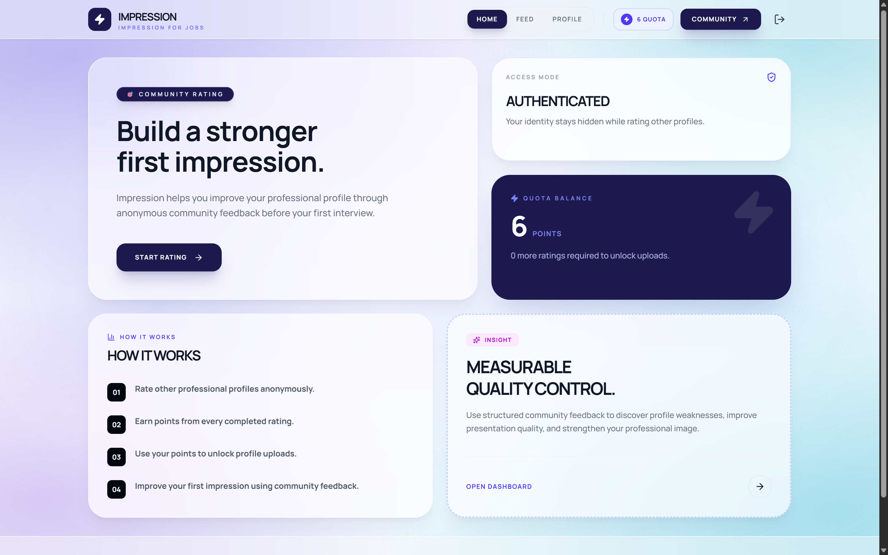
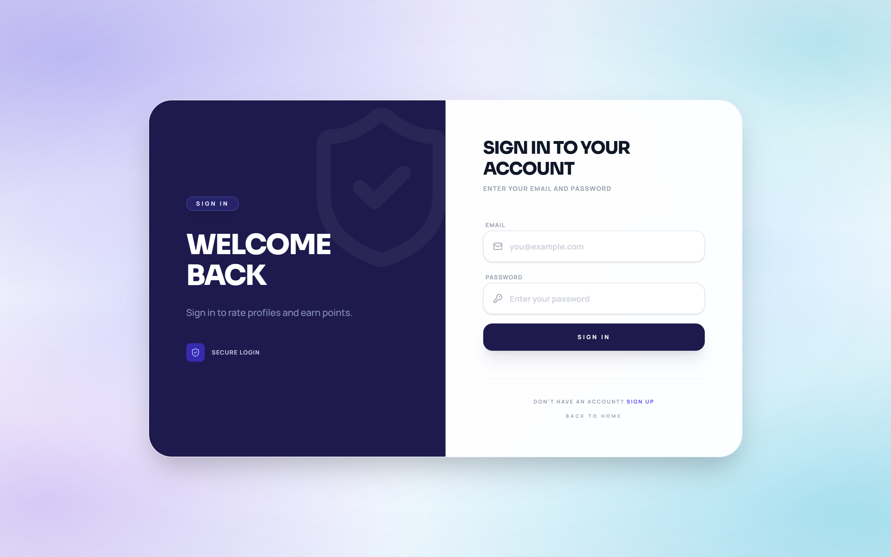
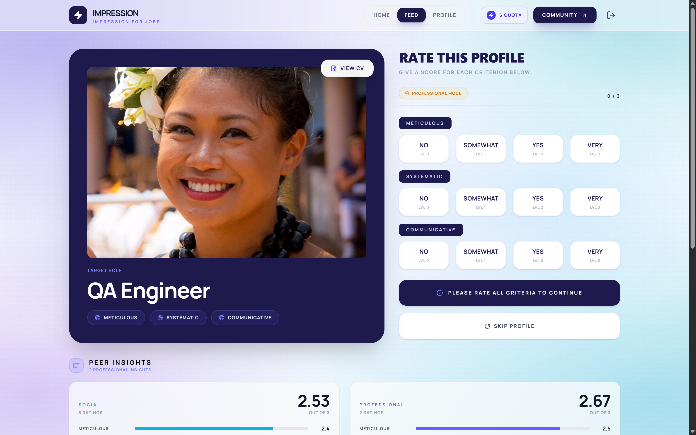
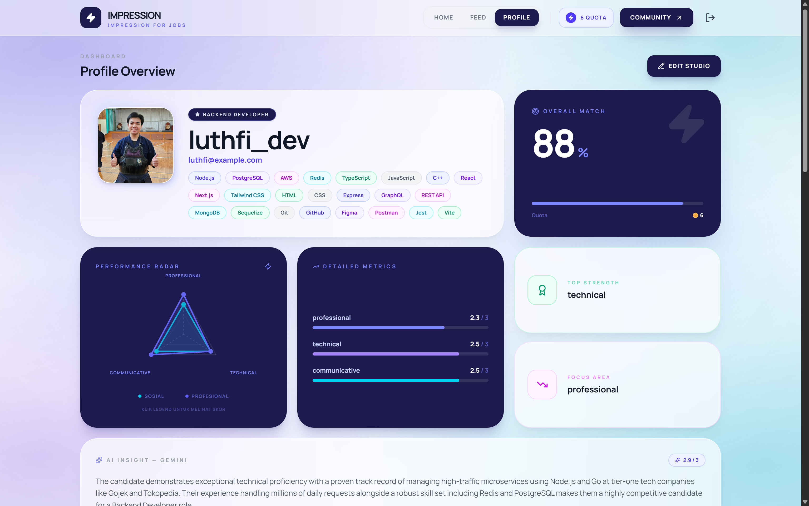
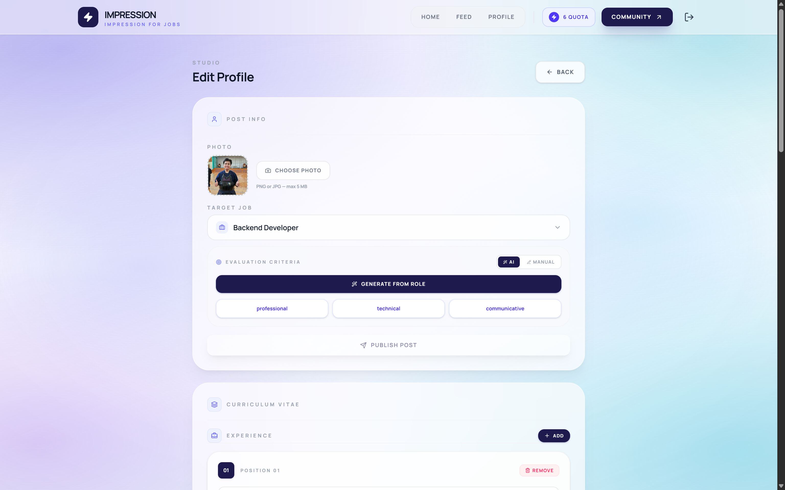
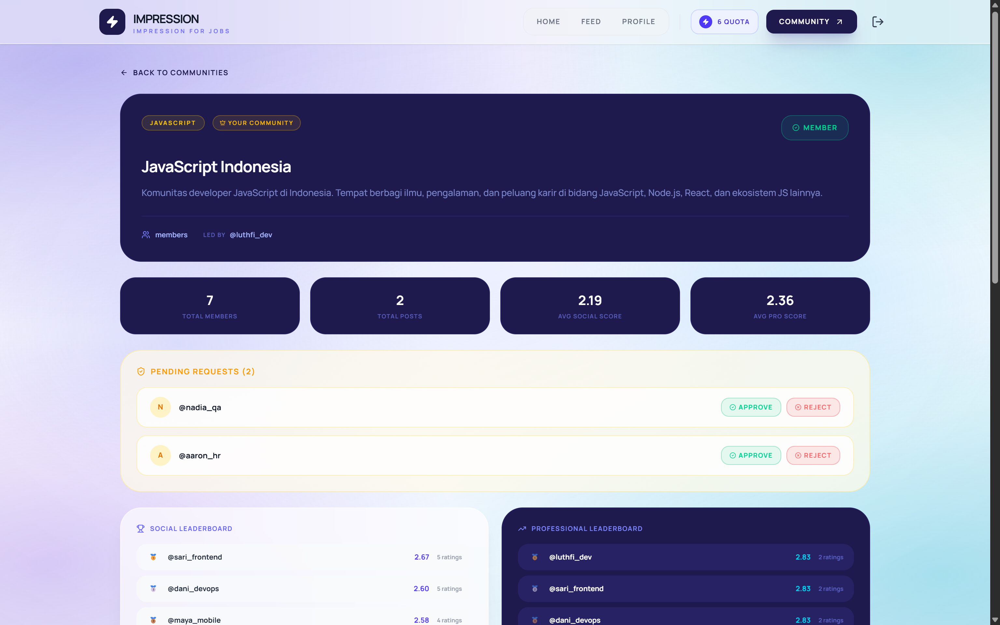

# Impression — Client

> Frontend for **Impression**, a professional profile rating platform. Rate anonymous profiles, earn quota, build your CV, and get AI-powered feedback on your professional presentation.

**Live:** [impression-job.vercel.app](https://impression-job.vercel.app) &nbsp;|&nbsp; **API:** [api.skirk.my.id](https://api.skirk.my.id) &nbsp;|&nbsp; **Org:** [HCK94-FP-Impression](https://github.com/HCK94-FP-Impression)

---

## Tech Stack


---

## Pages

| Route            | Description                                                                                  |
| ---------------- | -------------------------------------------------------------------------------------------- |
| `/`              | Landing page with quota balance and how-it-works guide                                       |
| `/register`      | Register a new account                                                                       |
| `/login`         | Login                                                                                        |
| `/feed`          | Rate a random profile with per-criteria scoring                                              |
| `/profile`       | Personal dashboard: rating breakdown, radar chart, AI insight, job recommendations           |
| `/studio`        | Create/update post with image upload, AI criteria generation, CV editor, AI profile analysis |
| `/comunity`      | Browse and join communities                                                                  |
| `/comunity/[id]` | Community dashboard with leaderboard, member management, and forum                           |

---

## Screenshots

### Landing Page



### Login



### Feed — Rate a Profile



### Profile Dashboard



### Studio — Edit Profile & CV



### Community Dashboard



---

## Features

- **Cookie-based authentication** — httpOnly cookie from server; localStorage marker for client-side UI state
- **Quota system** — quota balance displayed on landing page; earning and spending quota reflected in real time
- **Feed** — random profile card with per-criteria score sliders and optional insight for professional raters
- **Radar chart** — visual breakdown of social vs professional scores on profile dashboard
- **Studio** — unified editor for post (image, target job, criteria) and CV (experiences, educations, skills) with AI criteria generation and one-time AI analysis
- **Community** — explore tab, join-request flow, leader approve/reject queue, community leaderboard (social and professional), forum via Disqus embed
- **Job recommendations** — Jooble-powered listings based on user's target job

---

## Getting Started

### Prerequisites

- Node.js v18+

### Installation

```bash
git clone https://github.com/HCK94-FP-Impression/impression-client.git
cd impression-client
npm install
```

### Environment Variables

Create a `.env.local` file:

```env
NEXT_PUBLIC_API_URL=https://api.skirk.my.id
```

### Running the Dev Server

```bash
npm run dev
```

Open [http://localhost:3000](http://localhost:3000).

---

## Team

| Role         | Name               | GitHub                                             |
| ------------ | ------------------ | -------------------------------------------------- |
| Lead Backend | Ahmad Luthfi Hanif | [@AhmadSerafu](https://github.com/AhmadSerafu)     |
| Backend      | Aaron Arquette     | [@aaronarquette](https://github.com/aaronarquette) |
| Frontend     | Trimulia           | [@Trimulia02](https://github.com/Trimulia02)       |

---

_Hacktiv8 Full Stack JavaScript Bootcamp — Grand Final Project, Cohort HCK-94_
